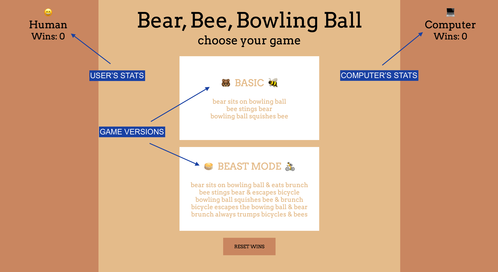
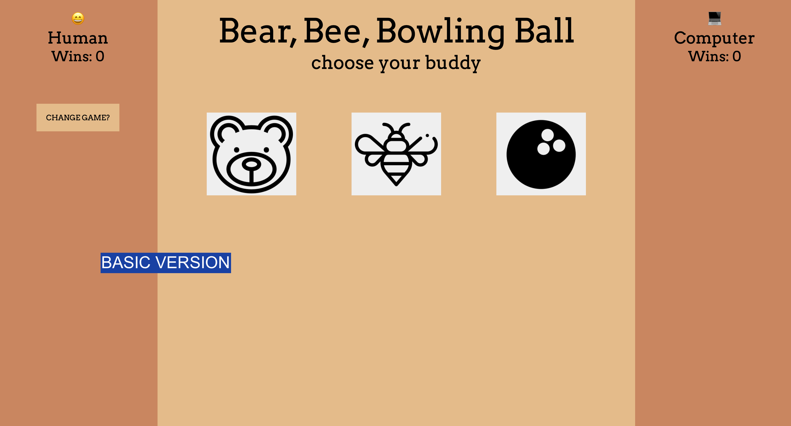
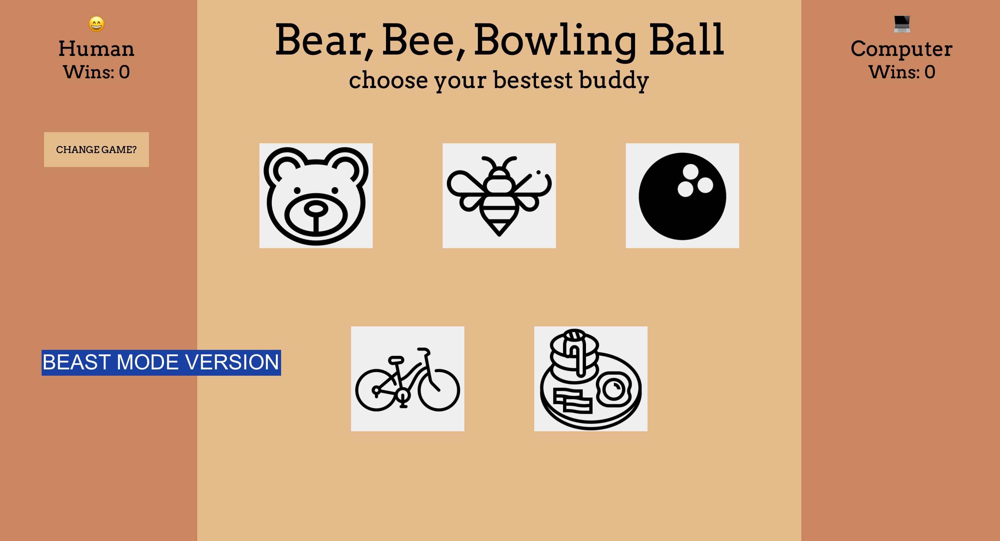

# Bear, Bee, & Bowling Ball: A Whimsical Rock-Paper-Scissors Game

## Table of Contents   
  - [Overview](#overview)
  - [Project / Game in Action](#project-/-game-in-action)
  - [Goals](#goals)
  - [Tech Stack](#tech-stack)
  - [Code Architecture](#code-architecture)
  - [Challenges](#challenges)
  - [Wins](#wins)
  - [Reflections](#reflections)
  - [Install & Use](#install-&-use)
  - [Contributions](#contributions)

## Overview  
A classic game with a new name! This is an application that allows users to play *two* versions of a [rock-paper-scissors](https://en.wikipedia.org/wiki/Rock_paper_scissors) game against the computer. Users can select between the *basic* **Bear-Bee-Bowling Ball** version of the game or the *beast-mode* **Bear-Bee-Bowling Ball-Bike-Brunch** version.
After selecting their preferred version of the game, users will then select a *buddy* which will immediately go head-to-head against a computer generated *buddy*. A tie or winner is declared and one point is awarded per win. Play one game, play one million!
[Play here!](https://anewb87.github.io/rock-paper-scissors/)

## Project / Game in Action  
1. When the application is first loaded, the score is 0-0. The *Human* (user) stats are displayed on the left side of the screen while the *Computer* stats are on the right.  
  

2. User selects which game version they would like to play. Once a selection is made, they are then presented with their *buddy* options.  
Basic Version:  
  
Beast Mode Version:


3. User then selects a *buddy* and plays as many rounds as they'd like.  
The user has the option to change the type of game they'd like to play and can reset the win count. The current win count automatically saves to local storage so the user can come back to the game at any point and the scores will persist. The user has the ability to reset the score back to 0-0 as well.  
Game Demo:  


## Goals  
- Solidify and demonstrate an understanding of:
  - DRY JavaScript
  - Local storage for persisting data
  - Event delegation to handle similar event listeners
- Understand the difference between the data model and how the data is displayed on the DOM
- Use problem solving process to break down large problems into small steps

## Tech Stack  
HTML  
CSS  
JavaScript  

## Code Architecture  
- Player Class (player.js)  
  - A constructor that includes a name, token, wins, and buddy (the player's *fighter/weapon*)  
  - Methods that save and retrieve player wins from local storage and determine how a player takes a turn
- Game Class (game.js)  
  - A constructor that includes the properties (data) of the game board: two instances of the Player class (human and computer), the displayed message, and the type of game  
  - Methods that check for win and tie conditions and that reset the game  
- Main (main.js)  
  - Includes all DOM manipulation

## Challenges  
This project was full of opportunities for learning and growth (aka challenges).  
- The first major hurdle was deciphering what methods and functions belonged in the the classes vs the main files; this really tested my understanding of data model and DOM. Additionally, because the two classes interact with each other and those interactions then need to be displayed on the DOM, it felt like nothing worked until everything worked. It often became frustrating to troubleshoot because I wasn't quite sure where the REAL problem originated as one problem was nested inside of another problem inside of another problem, etc.  
- Another major hurdle I needed to figure out how to jump came near the end of the project when I was dealing with the human player token (the emoji) that appears underneath the user's selected buddy before the view changes. I misunderstood what the token property was from the outset of the project (explained more below). Consequently, I set up my HTML...just wrong: I hard-coded the emojis into my HTML not realizing they were the tokens in the player class. I built out functionality around this, and it was working. Then a classmate clarified that the token was meant to be the emoji. I felt defeated and spent quite awhile trying to re-work my HTML and the functions attached to it. This forced me into a trial and error phase of methods I wasn't previously exposed to. Eventually, I got it to work the way the project spec intends.  
- A final challenge was, too often and unfortunately, deciphering what the project spec was actually saying. On two very specific instances, I *thought* I understood the objective but was wrong. Thank goodness for cohort-mates with different eyes, understandings, and thought-processes. (And an instructor who can confirm them.)   The first big instance of this I outlined above with the tokens. The second dealt with properties in the player class. Because a couple of the required player class properties are displayed on the DOM on the page load, I interpreted that to mean that I needed to access the player properties and write functionality to display them on the DOM on the page load. This is well and fine but didn't really make sense to me since those particular properties, that particular information, NEVER changes; it's static. It also requires more code to update the DOM on the page load than to have this static information in the HTML. After doing this the long way, I checked in with an instructor and was informed that for accessibility reasons, and simply because it does make more logical sense, having that information (because it is static) hard-coded into the HTML is the more-correct way to approach this situation.


## Wins  
Every time something worked, it felt like a major win!  
- Employing brand new-to-me methods/functions (like a `setTimeout()` or creating an element and then appending it to a parent node, for example) felt really great. The struggle of obtaining knowledge and adding more info to my 'arsenal' to use in the future is very real, but very worth it.  
- A big win for me is the functionality. I can't find any bugs while playing my game, it's fully functional, I've added two additional pieces of functionality to the game, and I feel like it accomplishes the requirements of the project well.  
- CSS was fun for the first time! It's pretty simple and straightforward, nothing too intense, but I actually found that I enjoyed it rather than it was a huge headache of an obstacle. I enjoy design in general, and could see myself really growing to enjoy CSS.  

## Reflections  
Some additional reflections:  
- Front-loading on this project was *key* for me. At the outset, it seemed like it was going to be a sprinting marathon. Because that was my first impression, I took off from the starting block and kept at it. I feel that decision has served me well and given me enough time to clean up my work.  
- I'm learning how important it is to reach out for clarification early and then as often as necessary. I ended up re-working a number of aspects of my project because, even though I was unsure, I powered on only to find out later that I had misunderstood the requirement. This causes a lot of discouragement and time wasted. It's *always* a good idea to get another set of eyes on the instructions, to get a second opinion, to talk out and really solidify the goals BEFORE getting in too deep.

## How to Install and Use   
In your terminal, run:
```   
git clone git@github.com:anewb87/rock-paper-scissors.git
cd rock-paper-scissors    
open index.html      
```

## Deployment Link
https://anewb87.github.io/rock-paper-scissors/

## Contributions
Application Developer:      
- [Lexy Newby](https://github.com/anewb87)

Code Review:
- [Justin Torrance](https://github.com/JustinTorrance)

Boilerplate Code Credits:     
- [Jeremiah Black](https://github.com/jeremiahblackol)     
- [Original Project Specifications](https://frontend.turing.edu/projects/module-1/rock-paper-scissors-solo.html) by Turing School of Software & Design     


